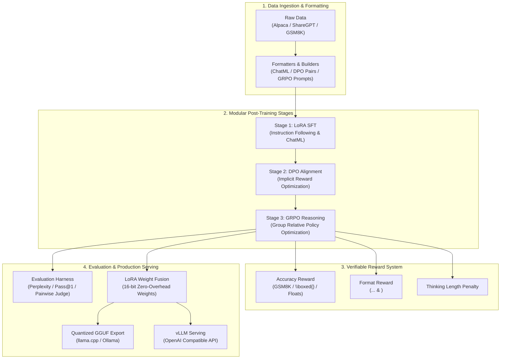

# RLFinetuneLab 🧪

[](https://github.com/amaannn08/RLFinetuneLab/actions)
[](https://www.python.org/downloads/)
[](https://pytorch.org/)
[](https://github.com/huggingface/trl)
[](https://github.com/huggingface/peft)
[](https://opensource.org/licenses/MIT)

A production-grade, config-driven Reinforcement Learning and alignment fine-tuning pipeline engineered specifically for **Small Language Models (SLMs)** (0.5B – 3B parameters, such as Qwen 2.5 and Llama 3.2).

RLFinetuneLab standardizes the post-training lifecycle from **Supervised Fine-Tuning (SFT)** through **Direct Preference Optimization (DPO)** to **Group Relative Policy Optimization (GRPO)** with verifiable reward modeling, automated benchmarking, weight merging, and high-throughput vLLM / GGUF deployment.

---

## 📌 Motivation & System Architecture

Small language models (≤ 3B) possess high inference efficiency but require careful alignment and reasoning elicitation to prevent catastrophic forgetting, format degradation, and reward hacking. RLFinetuneLab provides a modular, reproducible framework designed around:

1. **Config-First Architecture**: Strictly typed Pydantic v2 schemas validate all hyperparameters before execution, with flexible dot-notation CLI overrides (`--set training.learning_rate=2e-5`).
2. **Memory-Conscious Training**: Native 4-bit QLoRA (`bitsandbytes` NF4 with double quantization), gradient checkpointing, SDPA/FlashAttention-2, and adapter-disabled reference logprob evaluation during DPO (halving VRAM requirements).
3. **DeepSeek-R1 Style Reasoning RL**: Full GRPO implementation without the memory overhead of a separate Value/Critic model, leveraging verifiable deterministic rewards (exact math correctness, LaTeX boxed extraction, and `<think>...</think>` XML format enforcement).
4. **Offline Mock & Smoke Testing Engine**: An in-memory dummy architecture allows full local verification in under 2 seconds on CPU with **zero network downloads**, preserving laptop RAM while training code targets cloud GPUs (Google Colab free T4, A100, H100).



---

## ⚡ Hardware & VRAM Sizing Matrix

The pipeline is tuned for commodity cloud hardware (e.g. Google Colab free T4 GPU) up to enterprise clusters:

| Model | Technique | Precision | Context Len | Batch Size (Effective) | Min VRAM | Target GPU |
| :--- | :--- | :--- | :--- | :--- | :--- | :--- |
| **Qwen2.5-0.5B** | 4-bit QLoRA | NF4 / BF16 | 1024 tokens | 16 (4 batch × 4 grad accum) | **4.2 GB** | **Free Colab T4 (15GB)** |
| **Qwen2.5-0.5B** | 16-bit LoRA | BF16 / FP16 | 2048 tokens | 16 (4 batch × 4 grad accum) | **6.8 GB** | **Free Colab T4 (15GB)** |
| **Qwen2.5-1.5B** | 4-bit QLoRA | NF4 / BF16 | 2048 tokens | 16 (2 batch × 8 grad accum) | **8.5 GB** | **Free Colab T4 (15GB)** |
| **Qwen2.5-1.5B** | 16-bit LoRA | BF16 / FP16 | 2048 tokens | 16 (2 batch × 8 grad accum) | **14.2 GB** | RTX 4090 / A10G |
| **Qwen2.5-3B**   | 4-bit QLoRA | NF4 / BF16 | 2048 tokens | 16 (1 batch × 16 grad accum)| **13.8 GB** | **Free Colab T4 (15GB)** |
| **Llama-3.2-3B** | 4-bit QLoRA | NF4 / BF16 | 4096 tokens | 16 (1 batch × 16 grad accum)| **15.2 GB** | RTX 4090 / A100 |

*Note: For local development on machines without dedicated GPUs, use `rlfinetune smoke` to run local in-memory tests.*

---

## 🚀 Quickstart

### 1. Installation

```bash
# Clone the repository
git clone https://github.com/amaannn08/RLFinetuneLab.git
cd RLFinetuneLab

# Create and activate environment
python3 -m venv .venv
source .venv/bin/activate

# Install core dependencies
pip install -r requirements.txt
pip install -e .

# (Optional) For CUDA environments with GPU:
# pip install bitsandbytes flash-attn --no-build-isolation
```

### 2. Verify Local Setup (Zero-GPU Safe Smoke Mode)

Before launching heavy cloud jobs, verify pipeline code locally in 1 second using an in-memory mock model (zero HF Hub downloads):

```bash
rlfinetune smoke
```

### 3. Stage 1: Supervised Fine-Tuning (SFT)

Fine-tune `Qwen2.5-0.5B-Instruct` on ChatML conversational data with 4-bit QLoRA:

```bash
rlfinetune train --config configs/sft/qwen2.5_0.5b_qlora.yaml
```

CLI hyperparameter override example:
```bash
rlfinetune train --config configs/sft/qwen2.5_0.5b_qlora.yaml \
    --set sft.learning_rate=3e-4 \
    --set sft.num_train_epochs=2.0 \
    --set lora.r=32
```

### 4. Stage 2: Direct Preference Optimization (DPO)

Align model preferences using chosen/rejected pairs with adapter-disabled reference logprobs:

```bash
rlfinetune train --config configs/dpo/qwen2.5_0.5b_dpo.yaml \
    --set dpo.beta=0.1 \
    --set dpo.loss_type=sigmoid
```

### 5. Stage 3: Group Relative Policy Optimization (GRPO)

Train reasoning capabilities on GSM8K using group sampling ($G=4$) and verifiable math rewards:

```bash
rlfinetune train --config configs/grpo/qwen2.5_0.5b_grpo.yaml \
    --set grpo.num_generations=4 \
    --set grpo.beta=0.04
```

### 6. Benchmark Evaluation & Pairwise Win-Rate

Run perplexity and verifiable accuracy benchmarks:

```bash
rlfinetune eval --config configs/eval/benchmark_eval.yaml --output-dir outputs/eval_results
```

---

## 🔬 Reward Function Engineering (GRPO)

In GRPO, the policy generates a group of $G$ outputs $\{o_1, \dots, o_G\}$ for each query $q$. The advantages $\hat{A}_i$ are normalized relative to group reward statistics:

$$\hat{A}_i = \frac{r_i - \text{mean}(\{r_1, \dots, r_G\})}{\text{std}(\{r_1, \dots, r_G\}) + \epsilon}$$

RLFinetuneLab provides modular, verifiable reward callables in `rlfinetunelab/rewards/`:

- **`AccuracyReward`**: Extracts answers from `\boxed{...}`, `<answer>...</answer>`, or numeric termination sequences. Performs canonical normalization (stripping currency, whitespace, float tolerances). Awards $+1.0$ for exact ground-truth match.
- **`FormatReward`**: Evaluates structural adherence to chain-of-thought XML tags:
  - Valid `<think>...</think>` tags in sequence: $+0.5$
  - Valid `<answer>...</answer>` tags in sequence: $+0.5$
- **`ThinkingLengthReward`**: Gaussian penalty on runaway verbosity or trivial trivial 1-token reasoning steps.

Custom rewards can be registered in one line:
```python
from rlfinetunelab.rewards.base import BaseRewardFunction
from rlfinetunelab.rewards.registry import register_reward

@register_reward("code_syntax")
class CodeSyntaxReward(BaseRewardFunction):
    def compute_rewards(self, prompts, completions, targets, **kwargs):
        scores = []
        for comp in completions:
            try:
                compile(comp, "<string>", "exec")
                scores.append(1.0)
            except SyntaxError:
                scores.append(0.0)
        return scores
```

---

## 📦 Model Merging & Production Serving

### 1. Merge LoRA Weights
Fuses adapter parameters back into base model weights:
```bash
rlfinetune export \
    --base-model Qwen/Qwen2.5-0.5B-Instruct \
    --adapter outputs/sft_qwen0.5b/final_adapter \
    --output-dir outputs/merged_model \
    --torch-dtype bfloat16
```

### 2. Export to GGUF (llama.cpp / Ollama)
```bash
bash scripts/export_gguf.sh outputs/merged_model outputs/model_q4_k_m.gguf Q4_K_M
```

### 3. vLLM High-Throughput Deployment
Deploy an OpenAI-compatible API endpoint using the provided Docker Compose configuration:

```bash
docker compose -f configs/serve/docker-compose.yml up -d
```

Test query via cURL:
```bash
curl http://localhost:8000/v1/chat/completions \
  -H "Content-Type: application/json" \
  -d '{
    "model": "rlfinetunelab-model",
    "messages": [
      {"role": "user", "content": "Natalia sold 48 clips in April and half as many in May. How many total?"}
    ],
    "temperature": 0.6
  }'
```

---

## ☁️ Google Colab Free T4 Notebook

A self-contained notebook is available at:
`notebooks/qwen_rl_finetune_colab.ipynb`

- Pre-configured to execute inside Google Colab's free 15GB T4 GPU environment.
- Demonstrates SFT → DPO → GRPO → Evaluation → GGUF export end-to-end.

---

## 🧪 Testing & Verification

RLFinetuneLab features a comprehensive unit and integration test suite executing on synthetic mock fixtures without downloading model weights or relying on external APIs:

```bash
pytest tests/ -v
```

Test coverage includes:
- `test_config.py`: Pydantic v2 schemas, mutual exclusion validation, dot-notation overrides, serialization.
- `test_data_prep.py`: ChatML conversion, ShareGPT parsing, DPO pair filtering, GRPO prompt templates.
- `test_rewards.py`: Exact numeric equivalence, LaTeX box parsing, XML format compliance, composite pipelines.
- `test_lora_setup.py`: Parameter efficiency calculation, target module mapping, hardware profiling.
- `test_eval_harness.py`: Sliding-window perplexity calculation, pairwise win-rate comparison.
- `test_smoke_pipeline.py`: Full end-to-end 1-step SFT, evaluation, and weight fusion on in-memory mock causal LM.

---

## 📂 Repository Structure

```
RLFinetuneLab/
├── .github/workflows/ci.yml      # Automated GitHub Actions test matrix
├── configs/                      # Validated YAML configurations
│   ├── base_config.yaml          # Reference default template
│   ├── sft/                      # QLoRA 4-bit / 16-bit SFT configs
│   ├── dpo/                      # DPO alignment configs
│   ├── grpo/                     # DeepSeek-style GRPO reasoning configs
│   ├── eval/                     # Evaluation benchmark configs
│   └── serve/                    # vLLM configs & Docker Compose
├── notebooks/
│   └── qwen_rl_finetune_colab.ipynb # Free Colab T4 interactive notebook
├── rlfinetunelab/
│   ├── config/                   # Pydantic v2 schemas & YAML loader
│   ├── data/                     # ChatML formatters, DPO builder, GRPO datasets
│   ├── models/                   # QLoRA loader, BitsAndBytes, PEFT configuration
│   ├── trainers/                 # SFTTrainer, DPOTrainer, GRPOTrainer wrappers
│   ├── rewards/                  # Accuracy, format, and composite reward pipelines
│   ├── evaluation/               # Perplexity, generation eval, pairwise judge
│   ├── export/                   # LoRA merge & GGUF conversion utilities
│   ├── mock/                     # In-memory zero-download dummy models & smoke test
│   ├── utils/                    # Structured logging, hardware profiler, seed
│   └── cli.py                    # Unified CLI entrypoint (rlfinetune)
├── scripts/
│   ├── run_smoke_test.py         # Local CPU smoke test runner
│   ├── export_gguf.sh            # llama.cpp build & GGUF quantization
│   └── setup_env.sh              # Cloud GPU environment bootstrap
├── tests/                        # Offline pytest test suite
├── pyproject.toml                # Package definition and dependencies
├── requirements.txt              # Pinned production dependencies
├── LICENSE                       # MIT License
└── README.md
```

---

## 📄 License

This project is licensed under the MIT License - see the [LICENSE](LICENSE) file for details.

Developed with precision by **Amaan Gupta** (IIT Kharagpur).
